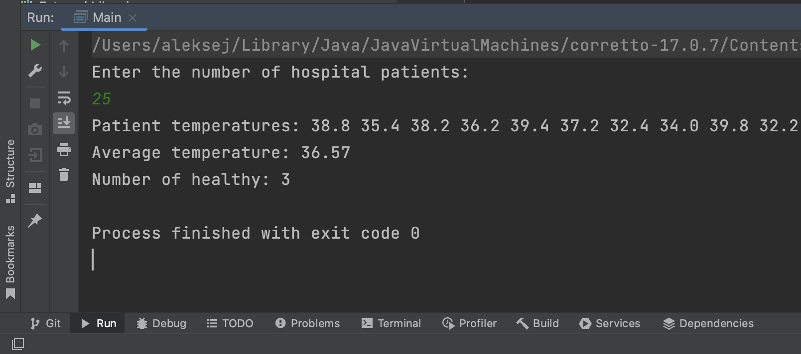
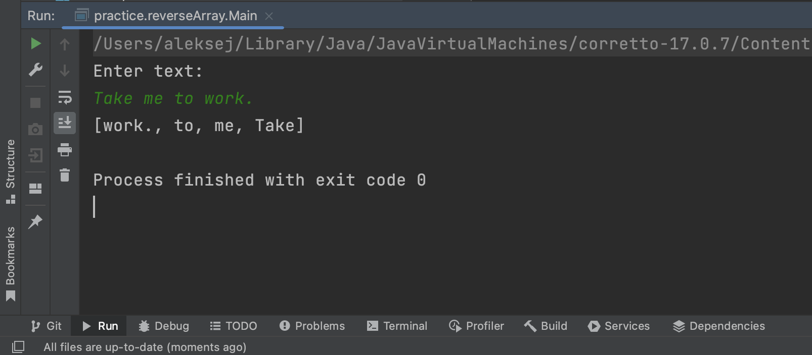
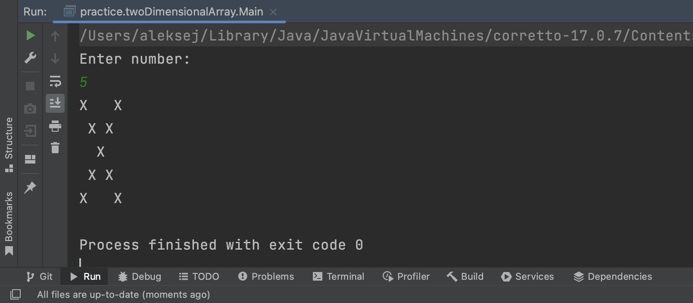

# CollectionsArray

A project to practice working with arrays.

____

### Hospital

This class generates patient temperatures and calculates the number of healthy patients with a temperature between 36.2 and 36.9 degrees.

____

### ReverseArray

This class reverses the order of elements and returns the same array.

____

### TwoDimensionalArray

This class that creates a two-dimensional array of a given size, on the diagonals of which there must be 'X' characters, in the remaining cells there is a space ' '.

